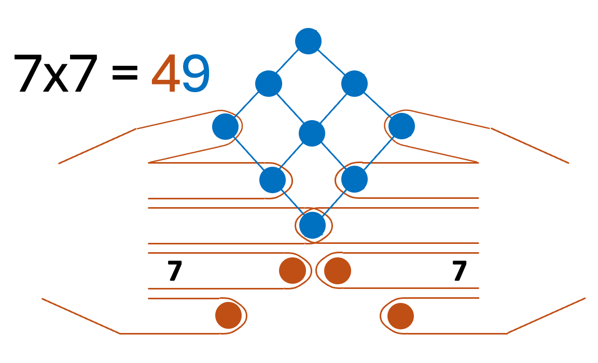
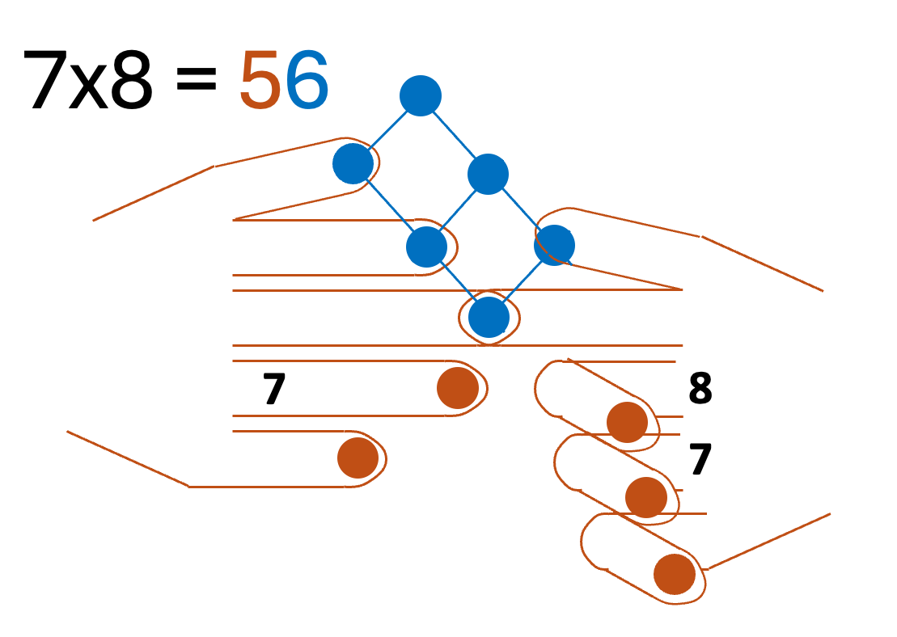

# Finger Multiplication — the 9×9 table with the tough-corner trick

An interactive, single-file web app for learning single-digit multiplication.
The full 9×9 table is color-coded, and the **hard corner (6–9 × 6–9)** is
highlighted green because that's where the **finger / complement trick** shines.

Tap any cell to open a dedicated, animated explanation.

## Illustrated

Two worked examples, drawn by hand. The **touching / folded orange fingers add
up to the tens**, and the **raised blue fingers form a grid whose area is the
units** (same arithmetic as below, just grouped the other way round):

## The trick (e.g. 7 × 8 = 56)

Each hand has **5** fingers. For a number `n` between 6 and 9:

- **Raise `n − 5` fingers.** Add the raised fingers of both hands → **tens**.
  `7` raises `2`, `8` raises `3` → `2 + 3 = 5` → **50**.
- **Folded fingers = `10 − n`** (what each needs to reach 10). Multiply the two
  folded counts → **units**. `7` folds `3`, `8` folds `2` → `3 × 2 = 6`.
- **Add the pieces:** `50 + 6 = 56`.

The animation shows the two raised rows sliding together to **add** (tens), and
the two folded groups rotating **orthogonal** to sweep out a grid whose area is
the **product** (units). Easy cells (anything with 1, 2, 5, or outside the
corner) get a simpler area-model animation.

## Run it

Just open `index.html` in any browser — no build step, no dependencies, works
offline. Deep links like `#/t/7/8` open a specific cell's animation.

## Keyboard

`→` / `←` step · `Space` play/pause · `Esc` back to the table.
